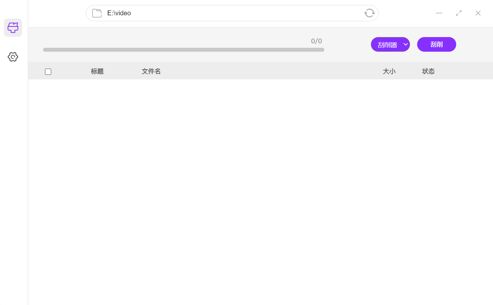

# JapaneseLearning-Capture

日语学习资料管理器，可管理日语词汇、语法解释、听力练习、阅读材料等。用于提高日语阅读、口语、听力水平，以应对JLPT（日本语能力测试）。祝各位早日考过N1、N2，加油！

## 声明

- **本项目使用python311，GUI框架使用[pywebview](https://github.com/r0x0r/pywebview)**
- 本项目不提供任何视频下载，只管理本地资源

- 本项目和项目成果仅供技术，学术交流和Python3性能测试使用
- 本项目贡献者编写该项目旨在学习Python3 ，提高编程水平
- 如有问题可在issue提出，本项目贡献者既不是程序员也不是cs专业，如遇到交流方面问题希望可以多点耐心，阿门
- 永久全部开源免费

## 预览

